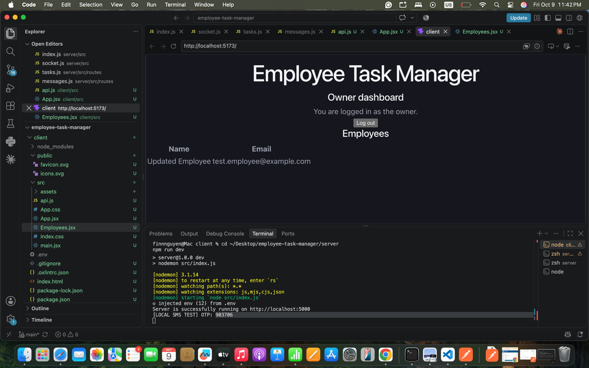

# Employee Task Manager

An employee and task management application built with React, Express, and Firebase Firestore.

The intended application allows an owner to manage employees, invite them to set up accounts, assign tasks, track progress, and communicate through chat.

**Current status: partial implementation.** The backend contains the main authentication, employee, task, and chat routes. The frontend currently supports owner login and viewing employee names and emails. The full application is not yet complete or deployed.

## Technology

- Frontend: React and Vite
- Backend: Node.js and Express
- Database: Firebase Firestore through the Firebase Admin SDK
- Authentication: JSON Web Tokens (JWT)
- Password and OTP hashing: bcrypt
- Live notifications: Socket.IO
- SMS integration: Twilio, with a local console mode
- Email: local invitation logging; SMTP delivery is not configured

## Current Features

### Frontend

- Owner login using a phone number and six-digit OTP
- Owner dashboard displaying employee names and emails
- Logout
- Loading and error messages

The login token is currently held in React memory. Refreshing the page requires logging in again.

### Backend

- Seeded owner account
- Owner OTP request and verification
- Five-minute OTP expiration
- Five failed verification attempts before blocking further verification
- Sixty-second cooldown between OTP requests
- JWT authentication and owner authorization middleware
- Employee creation, listing, editing, and deletion
- Email uniqueness checks using Firestore transactions
- Employee invitation tokens and account setup
- Employee login with a username and hashed password
- Task creation, listing, updating, and deletion
- Task access checks for owners and assigned employees
- Owner–employee chat message storage and retrieval
- Authenticated Socket.IO connections
- Task and message change notifications

Backend routes are implemented, but comprehensive end-to-end and concurrency testing remains unfinished.

## Project Structure

| Path | Purpose |
| --- | --- |
| `client/src/App.jsx` | Owner login and dashboard |
| `client/src/Employees.jsx` | Employee list |
| `client/src/api.js` | Shared frontend API request function |
| `server/src/index.js` | Express application and HTTP server |
| `server/src/config/firebase.js` | Firebase Admin and Firestore configuration |
| `server/src/middleware/auth.js` | JWT authentication and owner authorization |
| `server/src/routes/owner.js` | Owner OTP login and profile endpoint |
| `server/src/routes/employee.js` | Employee management, account setup, and login |
| `server/src/routes/tasks.js` | Task management |
| `server/src/routes/messages.js` | Chat message endpoints |
| `server/src/services/sms.js` | SMS delivery and local console testing |
| `server/src/services/email.js` | Invitation email service |
| `server/src/socket.js` | Authenticated socket connections |
| `server/scripts/seedOwner.js` | Initial owner account creation |
| `server/KNOWN_ISSUES.md` | Recorded issues |

## Local Setup

### Prerequisites

- Node.js and npm
- A Firebase project with a Firestore database
- A Firebase service account JSON key
- Twilio configuration for the current SMS service

Development used Node.js 22.23.3 and npm 10.9.9.

### 1. Clone the Repository

```bash
git clone https://github.com/finnnguyen/employee-task-manager.git
cd employee-task-manager
```

### 2. Configure Firebase

Enable Firestore in your Firebase project.

In Firebase Console, open **Project settings → Service accounts** and generate a private key.

Save the downloaded JSON file as:

```text
server/serviceAccountKey.json
```

The backend uses Firebase Admin credentials to access Firestore. Do not publish the service account key.

### 3. Configure the Backend

Create `server/.env`:

```env
PORT=5000
NODE_ENV=development

OWNER_PHONE=YOUR_PHONE_NUMBER_IN_INTERNATIONAL_FORMAT
JWT_SECRET=REPLACE_WITH_A_LONG_RANDOM_SECRET

TWILIO_ACCOUNT_SID=YOUR_TWILIO_ACCOUNT_SID
TWILIO_AUTH_TOKEN=YOUR_TWILIO_AUTH_TOKEN
TWILIO_PHONE_NUMBER=YOUR_TWILIO_PHONE_NUMBER

SMS_MODE=console
EMAIL_MODE=console
CLIENT_URL=http://localhost:5173
```

Use a phone number with a country code, such as `+1...`, for `OWNER_PHONE`.

The current SMS service validates the Twilio environment variables at startup, including when console mode is selected.

Generate a JWT secret with:

```bash
node -e "console.log(require('crypto').randomBytes(32).toString('hex'))"
```

Copy the result into `JWT_SECRET`.

Keep `.env` files and the service account key out of Git.

### 4. Install and Start the Backend

```bash
cd server
npm install
npm run seed:owner
npm run dev
```

The seed script creates the owner document if it does not already exist. To use a different owner phone later, update the existing owner record as well as the environment configuration.

Backend URL:

```text
http://localhost:5000
```

Keep this terminal running.

### 5. Configure and Start the Frontend

Create `client/.env`:

```env
VITE_API_URL=http://localhost:5000
```

In a second terminal, starting from the project root:

```bash
cd client
npm install
npm run dev
```

Open:

```text
http://localhost:5173
```

Keep both servers running. Restart Vite after changing its environment configuration.

## Testing the Current Frontend

1. Open the frontend.
2. Enter the phone number matching the seeded owner.
3. Click **Request OTP**.
4. Find the latest code in the backend terminal:

   ```text
   [LOCAL SMS TEST] OTP: ...
   ```

5. Enter the code and click **Verify and log in**.
6. The owner dashboard displays employees stored in Firestore.

With `SMS_MODE=console`, no SMS is sent to a phone. The current success message says “OTP sent successfully” even when delivery is simulated.

## API Overview

Protected endpoints require:

```text
Authorization: Bearer YOUR_LOGIN_TOKEN
```

| Method | Endpoint | Purpose |
| --- | --- | --- |
| POST | `/api/owner/request-otp` | Request an owner OTP |
| POST | `/api/owner/verify-otp` | Verify the OTP and receive a JWT |
| GET | `/api/owner/me` | Retrieve authenticated owner identity |
| GET | `/api/employees` | List employees |
| POST | `/api/employees` | Create and invite an employee |
| PATCH | `/api/employees/:id` | Update an employee |
| DELETE | `/api/employees/:id` | Delete an employee |
| POST | `/api/employees/setup-account` | Set up an invited employee account |
| POST | `/api/employees/login` | Employee username/password login |
| GET | `/api/employees/me` | Retrieve employee profile |
| POST | `/api/tasks` | Create an assigned task |
| GET | `/api/tasks` | List accessible tasks |
| PATCH | `/api/tasks/:id` | Update a task |
| DELETE | `/api/tasks/:id` | Delete a task |
| GET | `/api/messages/:employeeId` | Read conversation messages |
| POST | `/api/messages/:employeeId` | Send a conversation message |

Socket.IO emits `tasks:changed` and `messages:changed` notifications. Frontend integration for these events remains unfinished.

## Validation Performed

- Backend starts on port 5000.
- React frontend starts on port 5173.
- Owner login was manually verified using console OTP delivery.
- The authenticated frontend retrieves and displays employee names and emails.
- Selected backend endpoints were manually exercised during development.

These checks do not constitute a complete automated test suite.

## Known Limitations and Remaining Work

- Real Twilio OTP delivery is unresolved. A trial-account restriction rejected custom OTP messages; local console mode is currently used.
- SMTP invitation delivery is not configured. Invitation URLs are logged locally.
- Employee account setup and login screens are not yet implemented.
- Employee creation, editing, and deletion interfaces are not yet implemented.
- Task and chat interfaces are not yet implemented.
- Frontend live notification handling is not yet connected.
- Employee schedule management remains unfinished.
- Invitation recovery, account cleanup, and additional authentication rate limiting need further work.
- Responsive styling, automated tests, and full integration testing remain unfinished.
- Deployment has not been completed.

Console SMS and email modes are development tools and are disabled in production.

## Author

Finn Nguyen

## Application Screenshot

